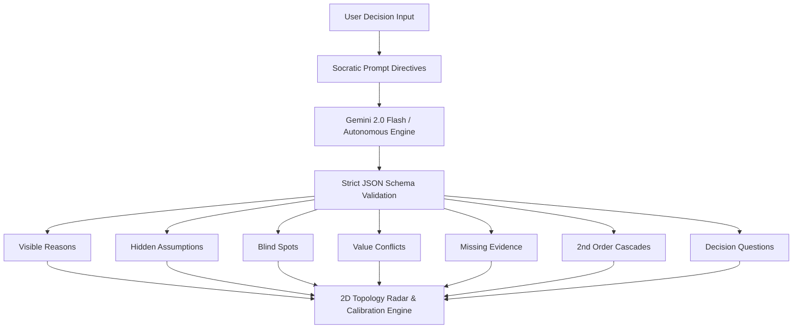

# BLINDSPOT — Reasoning X-Ray
> **See what your decision can't see.**  
> *An AI reasoning X-Ray that finds the assumptions, missing evidence, second-order effects, and contradictions hiding inside your decisions—without deciding for you.*

[](https://github.com/23Arya2006/Promptwars_Arya-Chighare)
[](https://vercel.com)
[](https://react.dev)
[](https://www.typescriptlang.org/)
[](https://tailwindcss.com)

---

## 🎯 The Core Axiom

> **"AI doesn't make the decision. It interrogates the reasoning behind it."**

Most AI tools answer: **"What should I do?"** *(yielding generic advice, hallucinations, and stripped human accountability)*  
**BLINDSPOT asks:** **"Why do you think that?"** *(deconstructing cognitive premises and elevating human decision agency)*

---

## 1. Problem
People often make critical personal, strategic, and professional decisions based solely on the information most visible to them. They routinely:
- Rely on unexamined, unstated assumptions.
- Overlook critical second-order dependencies.
- Harbor unrecognized internal contradictions between stated priorities and operational realities.
- Experience **confidence-evidence calibration mismatches**, committing before verifying fundamental facts.

---

## 2. Solution: The Reasoning X-Ray
**BLINDSPOT** reconstructs the user's decision rationale and visually exposes:
1. **Visible Premises**: What the user explicitly stated and considered.
2. **Hidden Assumptions**: Unverified premises with "Why questionable" and required empirical verification.
3. **Overlooked Blind Spots**: Critical operational factors completely absent from the user's conscious reasoning.
4. **Reasoning Conflicts**: Visual tension mapping between stated priorities and logistical realities.
5. **Missing Evidence**: An interactive checklist of facts that must be verified before deciding.
6. **Second-Order Effects**: Cascading downstream domino consequences ($A \to B \to C \to \text{Risk}$).
7. **Stakeholder Lens**: 360° multi-perspective analysis (You, Family, College/Org, Employer, Future 5-Year Self).
8. **Decision-Changing Questions**: The 5 highest-leverage inquiries capable of flipping the reasoning path.
9. **Confidence vs. Evidence Calibration**: A diagnostic gauge calculating the gap between subjective conviction and verified data.

---

## 3. Signature Features

### 📡 The Blind Spot Radar (Interactive 2D Topology)
A clean, custom 2D node graph mapping the causal relationships discovered in your reasoning.
- Central Decision Node with categorized orbital and causal layouts.
- Dynamic color semantics: Slate (Visible), Amber (Assumption), Red (Blind Spot), Purple (Conflict), Sky (Evidence), Pink (2nd Order).
- Click to inspect nodes, hover to trace causal dependencies.

### 🔥 Assumption Stress-Test Simulator
An interactive counterfactual simulator for every key assumption.
- Tests how your conviction holds up under realistic "What if...?" pressure.
- Real-time choice tracking: *This changes my thinking*, *This doesn't change my thinking*, or *I need more evidence*.

### ⚡ The Decision-Changing Question Engine
Five high-impact Socratic questions labeled by impact level (`HIGH IMPACT`, `MEDIUM IMPACT`, `LOW IMPACT`) with built-in reflection scratchpads.

### ⚖️ Confidence vs. Evidence Calibration
An interactive slider and coverage meter comparing subjective conviction (0–100%) against empirical evidence coverage, providing calibration feedback without judging the user.

### 📓 Decision Journal & "I'll Make the Decision"
Before vs. After X-Ray evolution tracking, unresolved questions checklist, Markdown report export, and a final empowering human agency claim.

---

## 4. Judge Demo Flow (60–90 Seconds)

1. **Open the App** $\to$ Review the Hero and 2D Animated Reasoning Scan.
2. **Click "TRY DEMO"** or select **"Internship vs College Schedule"** in the Decision Lab.
3. **Click "RUN REASONING X-RAY"** $\to$ Watch the progressive Socratic scanner deconstruct premises.
4. **Explore the Blind Spot Radar** $\to$ Switch between **Radial Radar** and **Causal Flow** modes; click an assumption node to inspect why it's questionable.
5. **Run the Assumption Stress Test** $\to$ Click *"This changes my thinking"* on the commute fatigue scenario.
6. **Check Confidence vs Evidence** $\to$ Adjust the confidence slider and observe the calibration delta.
7. **End at the Decision Journal** $\to$ Check off unresolved investigations and click **"I'LL MAKE THE DECISION"** to claim human ownership.

---

## 5. Technology Stack
- **Framework**: React 19 + TypeScript + Vite
- **Styling**: Tailwind CSS with custom dark charcoal design tokens, semantic color indicators, and glassmorphic layers
- **Icons & Visuals**: Lucide React
- **Celebration Feedback**: Canvas-Confetti
- **AI Integration**: Google Gemini 2.0 / 1.5 Flash Socratic Engine with structured JSON schema validation and zero-dependency client fallback.

---

## 6. Socratic AI Architecture



### Pure Socratic Rules
- Never make the decision for the user.
- Never say "You should choose X".
- Distinguish `FACT` from `ASSUMPTION` and `UNKNOWN`.
- Phrase uncertain factors as investigative possibilities.

---

## 7. Local Setup & Installation

```bash
# 1. Clone repository
git clone https://github.com/23Arya2006/Promptwars_Arya-Chighare.git
cd Promptwars_Arya-Chighare

# 2. Install dependencies
npm install

# 3. Start local development server
npm run dev

# 4. Build for production
npm run build
```

---

## 8. Environment Variables

Create a `.env` file in the root directory (optional):

```env
# Optional Gemini API key
VITE_AI_API_KEY=your_gemini_api_key_here
VITE_GEMINI_API_KEY=your_gemini_api_key_here
```

> **Note on Prototype Security:** For this competition prototype, client-side API keys can be configured via environment variables or in the in-app Settings modal (stored in `localStorage`). In a commercial production deployment, API keys should be moved behind a server-side proxy (e.g., Next.js API route or Cloudflare Worker) to prevent client-side exposure.

---

## 9. Vercel Deployment

The repository includes a pre-configured `vercel.json`:

```json
{
  "framework": "vite",
  "buildCommand": "npm run build",
  "outputDirectory": "dist",
  "rewrites": [{ "source": "/(.*)", "destination": "/index.html" }]
}
```

### Deploy to Vercel in 1 Click:
1. Push to GitHub: `git push origin main`
2. Import repository into [Vercel Dashboard](https://vercel.com/new).
3. Set Framework to **Vite** (auto-detected).
4. Click **Deploy**.

---

## 10. License & Credits
Built for the **PromptWars / Prompathon** competition.  
Crafted with the Socratic AI Reasoning Framework.